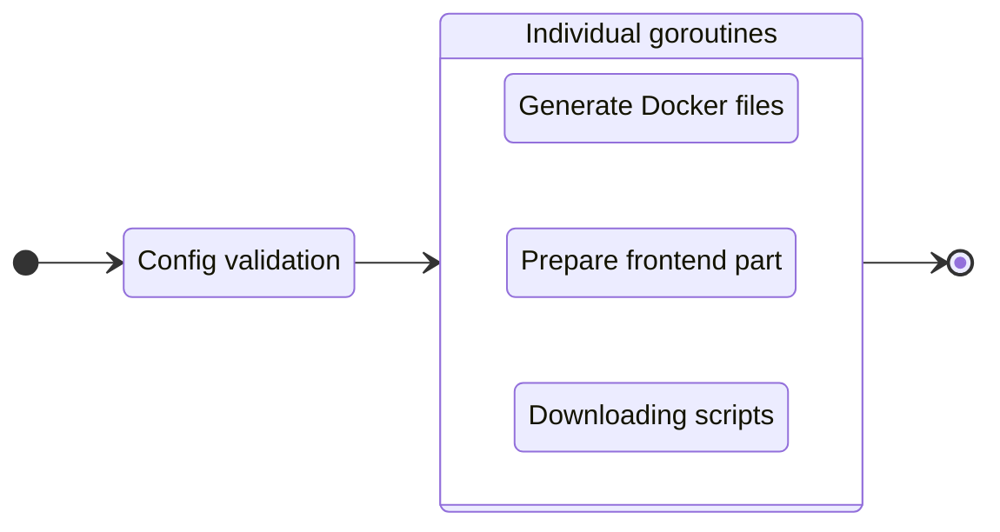

---
next:
  text: 'FAQ'
  link: '/faq'
---

# Build your project

To prepare your project to the production, execute the `build` command:

::: code-group
```bash [CLI]
gowebly build [OPTION]
```

```bash [Go]
go run github.com/gowebly/gowebly@latest build [OPTION]
```

```bash [Docker]
docker run --rm -it -v ${PWD}:${PWD} -w ${PWD} gowebly/gowebly:latest build [OPTION]
```
:::

Possible options:

| Option          | Description                                         | Is required? |
| --------------- | --------------------------------------------------- | :----------: |
| `--skip-docker` | CLI skips a generation process for the Docker files |      No      |

<!--@include: ../parts/block_default_config.md -->


## What CLI does for you?

Every time you execute the `build` command for a project, the **Gowebly** CLI does the following under the hood:

| Step  | Description                                                                                                         | Is async? |
| ----- | ------------------------------------------------------------------------------------------------------------------- | :-------: |
| **1** | **CLI validates the config and applies it to the current project**                                                  |    No     |
| **2** | **CLI prepares the Docker files for your project**                                                                  |           |
| 2.1   | If `--skip-docker` option is not set, CLI generates the needed Docker files (`docker-compose.yml` and `Dockerfile`) |    Yes    |
| **3** | **CLI prepares the frontend part of your project**                                                                  |           |
| 3.1   | CLI runs a `build:prod` script from the `package.json` file with the chosen JavaScript runtime environment          |    Yes    |
| **4** | **CLI downloads minimized versions of htmx and hyperscript from the trusted [unpkg.com][other_unpkg_url] CDN**      |    Yes    |

::: tip Asynchronous steps
The **Gowebly** CLI runs all blocks with asynchronous steps in individual **goroutines**. Therefore, building your project is several times faster than if you start each step one after another.
:::

## Diagram

For visualization of the **Gowebly** CLI workflow, check the diagram:



## Project structure after building

Typically, after running the `build` command, the project structure looks like this:

```bash{9-10}
.
├── assets
│   └── ...
├── static
│   └── ...
├── templates
│   └── ...
├── .gitignore
├── docker-compose.yml
├── Dockerfile
├── go.mod
├── go.sum
├── handlers.go
├── main.go
├── package.json
├── package-lock.json
└── server.go
```

## Docker Compose

The **Gowebly** CLI generates the `docker-compose.yml` file for you with the following settings:

```yaml
version: '3.8'

services:
  gowebly_default:
    build:
      context: .
      dockerfile: Dockerfile
    restart: unless-stopped
    ports:
      - '7000:7000'
    environment:
      BACKEND_PORT: 7000
      BACKEND_READ_TIMEOUT: 5
      BACKEND_WRITE_TIMEOUT: 10
    networks:
      - gowebly_default_network

networks:
  gowebly_default_network:
```

- The `_default` suffix will be updated by name of the chosen Go framework.
- The backend port should be the same as the exposed container port (by default, `7000`).
- The `_default_` middle part will be updated by name of the chosen Go framework.

## Dockerfile

The **Gowebly** CLI generates the `Dockerfile` file for you with the following settings:

::: code-group
```dockerfile{17} [Without template engines]
FROM golang:1.21-alpine AS builder

WORKDIR /build

COPY go.mod go.sum ./
RUN go mod download

COPY . .

ENV CGO_ENABLED=0
RUN go build -ldflags="-s -w" -o gowebly_default

FROM scratch

COPY --from=builder /build/static /static
COPY --from=builder /build/gowebly_default /
COPY --from=builder /build/templates /templates

ENTRYPOINT ["/gowebly_default"]
```

```dockerfile [Using Templ]
FROM golang:1.21-alpine AS builder

WORKDIR /build

COPY go.mod go.sum ./
RUN go mod download

COPY . .

ENV CGO_ENABLED=0
RUN go build -ldflags="-s -w" -o gowebly_default

FROM scratch

COPY --from=builder /build/static /static
COPY --from=builder /build/gowebly_default /

ENTRYPOINT ["/gowebly_default"]
```
:::

::: tip Using Templ
When you use the **Templ** templating engine, you no longer need to include the `./templates` folder in your container. All templates are regular Go functions and will be automatically included in the build of your application.
:::

<!--@include: ../parts/links.md -->