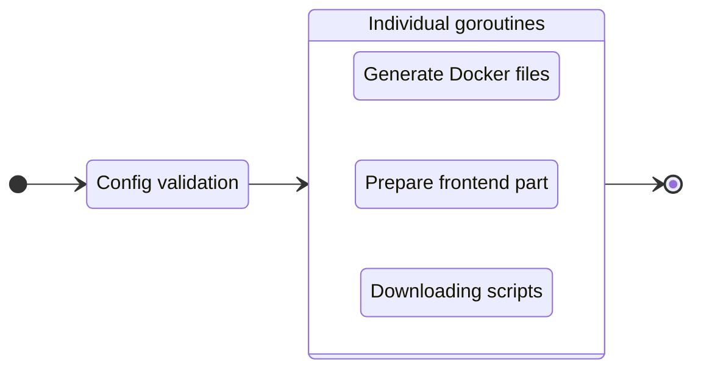

# Build your project

!!! info "Using a default config"
    If you don't run `init` command to create a config file (`.gowebly.yml`), the **Gowebly** CLI builds your project with a [default][repo_default_config] configuration.

To prepare your project to the production, execute the `build` command:

=== ":material-console-line: CLI"

    ``` bash
    gowebly build [OPTION]
    ```

=== "Go"

    ``` bash
    go run github.com/gowebly/gowebly@latest build [OPTION]
    ```

=== "Docker"

    ``` bash
    docker run --rm -it -v ${PWD}:${PWD} -w ${PWD} gowebly/gowebly:latest build [OPTION]
    ```

Possible options:

| Option          | Description                                         |         Is required?          |
| --------------- | --------------------------------------------------- | :---------------------------: |
| `--skip-docker` | CLI skips a generation process for the Docker files | :material-close:{.icon-close} |


### What CLI does for you?

Every time you execute the `build` command for a project, the **Gowebly** CLI does the following under the hood:

| Step  | Description                                                                                                         |           Is async?           |
| ----- | ------------------------------------------------------------------------------------------------------------------- | :---------------------------: |
| **1** | **CLI validates the config and applies it to the current project**                                                  | :material-close:{.icon-close} |
| **2** | **CLI prepares the Docker files for your project**                                                                  |                               |
| 2.1   | If `--skip-docker` option is not set, CLI generates the needed Docker files (`docker-compose.yml` and `Dockerfile`) | :material-check:{.icon-check} |
| **3** | **CLI prepares the frontend part of your project**                                                                  |                               |
| 3.1   | CLI runs a `build:prod` script from the `package.json` file with the chosen JavaScript runtime environment          | :material-check:{.icon-check} |
| **4** | **CLI downloads minimized versions of htmx and hyperscript from the trusted [unpkg.com][unpkg_url] CDN**            | :material-check:{.icon-check} |

!!! tip "Asynchronous steps"
    The **Gowebly** CLI runs all blocks with asynchronous steps in individual **goroutines**. Therefore, building your project is several times faster than if you start each step one after another.

#### Diagram

For visualization of the **Gowebly** CLI workflow, check the diagram:



### Project structure after building

Typically, after running the `build` command, the project structure looks like this:

``` bash hl_lines="9 10"
.
├── assets
│   └── ...
├── static
│   └── ...
├── templates
│   └── ...
├── .gitignore
├── docker-compose.yml
├── Dockerfile
├── go.mod
├── go.sum
├── handlers.go
├── main.go
├── package.json
├── package-lock.json
└── server.go
```

### Docker Compose

The **Gowebly** CLI generates the `docker-compose.yml` file for you with the following settings:

``` yaml title="docker-compose.yml"
version: '3.8'

services:
  gowebly_default: #(1)!
    build:
      context: .
      dockerfile: Dockerfile
    restart: unless-stopped
    ports:
      - '7000:7000'
    environment:
      BACKEND_PORT: 7000 #(2)!
      BACKEND_READ_TIMEOUT: 5
      BACKEND_WRITE_TIMEOUT: 10
    networks:
      - gowebly_default_network

networks:
  gowebly_default_network: #(3)!
```

1. The `_default` suffix will be updated by name of the chosen Go framework.
2. The backend port should be the same as the exposed container port (by default, `7000`).
3. The `_default_` middle part will be updated by name of the chosen Go framework.

### Dockerfile

The **Gowebly** CLI generates the `Dockerfile` file for you with the following settings:

=== "Without template engines"

    ``` dockerfile title="Dockerfile" hl_lines="17"
    FROM golang:1.21-alpine AS builder

    WORKDIR /build

    COPY go.mod go.sum ./
    RUN go mod download

    COPY . .

    ENV CGO_ENABLED=0
    RUN go build -ldflags="-s -w" -o gowebly_default ./...

    FROM scratch

    COPY --from=builder /build/static /static
    COPY --from=builder /build/gowebly_default /
    COPY --from=builder /build/templates /templates

    ENTRYPOINT ["/gowebly_default"]
    ```

=== "Using Templ"

    ``` dockerfile title="Dockerfile"
    FROM golang:1.21-alpine AS builder

    WORKDIR /build

    COPY go.mod go.sum ./
    RUN go mod download

    COPY . .

    ENV CGO_ENABLED=0
    RUN go build -ldflags="-s -w" -o gowebly_default ./...

    FROM scratch

    COPY --from=builder /build/static /static
    COPY --from=builder /build/gowebly_default /
    #(1)!

    ENTRYPOINT ["/gowebly_default"]
    ```

    1. When you use the **Templ** templating engine, you no longer need to include the `./templates` folder in your container. All templates are regular Go functions and will be automatically included in the build of your application.

<!-- Links -->

[repo_default_config]: https://github.com/gowebly/gowebly/blob/main/internal/attachments/configs/default.yml
[unpkg_url]: https://unpkg.com