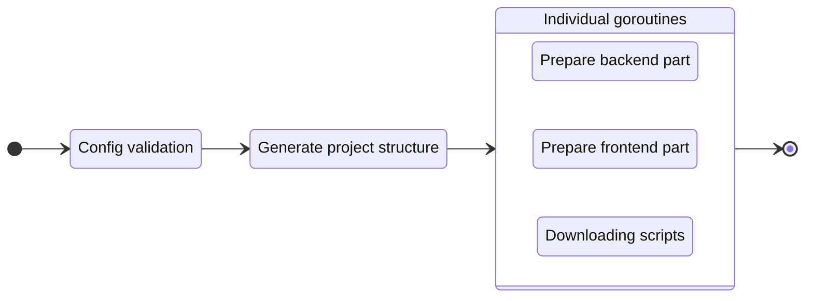

# Create a new project

To start a new project, execute the `create` command:

::: code-group
```bash [CLI]
gowebly create
```

```bash [Go]
go run github.com/gowebly/gowebly@latest create
```

```bash [Docker]
docker run --rm -it -v ${PWD}:${PWD} -w ${PWD} gowebly/gowebly:latest create
```
:::


## What CLI does for you?

Every time you execute the `create` command for a project, the **Gowebly** CLI does the following under the hood:

| Step  | Description                                                                                                        | Is async? |
| ----- | ------------------------------------------------------------------------------------------------------------------ | :-------: |
| **1** | **CLI generates the structure of your project (folders and files)**                                                |    No     |
| **2** | **CLI prepares the backend part of your project**                                                                  |           |
| 2.1   | CLI generates the needed utility files (`go.mod`, backend files, and so on)                                        |    Yes    |
| 2.3   | CLI runs `go mod tidy` and `go fmt`                                                                                |    Yes    |
| **3** | **CLI prepares the frontend part of your project**                                                                 |           |
| 3.1   | CLI generates the `styles.scss` file with minimal styles for the chosen CSS framework                              |    Yes    |
| 3.2   | CLI generates the needed utility files (`package.json`, config for the chosen CSS framework, and so on)            |    Yes    |
| 3.3   | CLI runs `install` and `build` scripts from the `package.json` file with the chosen JavaScript runtime environment |    Yes    |

::: tip Asynchronous steps
The **Gowebly** CLI runs all blocks with asynchronous steps in individual **goroutines**. Therefore, creating a new project is several times faster than if you start each step one after another.
:::

## Diagram

For visualization of the **Gowebly** CLI workflow, check the diagram:



## Project structure after creating

Typically, after running the `create` command, a created project contains the following files and folders:

::: code-group
```bash{21,22} [Without template engines]
.
├── assets
│   └── styles.css
├── static
│   ├── favicons
│   │   ├── apple-touch-icon.png
│   │   ├── favicon.ico
│   │   ├── favicon.png
│   │   ├── favicon.svg
│   │   ├── manifest-desktop-screenshot.jpeg
│   │   ├── manifest-mobile-screenshot.jpeg
│   │   └── manifest-touch-icon.svg
│   ├── images
│   │   └── logo.svg
│   ├── htmx.min.js
│   ├── hyperscript.min.js
│   ├── styles.css
│   └── manifest.json
├── templates
│   ├── pages
│   │   └── index.html
│   └── main.html
├── .gitignore
├── go.mod
├── go.sum
├── handlers.go
├── main.go
├── package.json
├── package-lock.json
└── server.go
```

```bash{22,24} [Using Templ]
.
├── assets
│   └── styles.css
├── static
│   ├── favicons
│   │   ├── apple-touch-icon.png
│   │   ├── favicon.ico
│   │   ├── favicon.png
│   │   ├── favicon.svg
│   │   ├── manifest-desktop-screenshot.jpeg
│   │   ├── manifest-mobile-screenshot.jpeg
│   │   └── manifest-touch-icon.svg
│   ├── images
│   │   └── logo.svg
│   ├── htmx.min.js
│   ├── hyperscript.min.js
│   ├── styles.css
│   └── manifest.json
├── templates
│   ├── pages
│   │   ├── index_templ.go
│   │   └── index.templ
│   ├── main_templ.go
│   └── main.templ
├── .gitignore
├── go.mod
├── go.sum
├── handlers.go
├── main.go
├── package.json
├── package-lock.json
└── server.go
```
:::

::: danger Auto-generated files by Templ
Please do **not** edit `*_templ.go` Go files in the `./templates` folder of your project! They're auto-generated by the **Templ** CLI from `*.templ` templates.
:::

<!--@include: ../parts/links.md -->