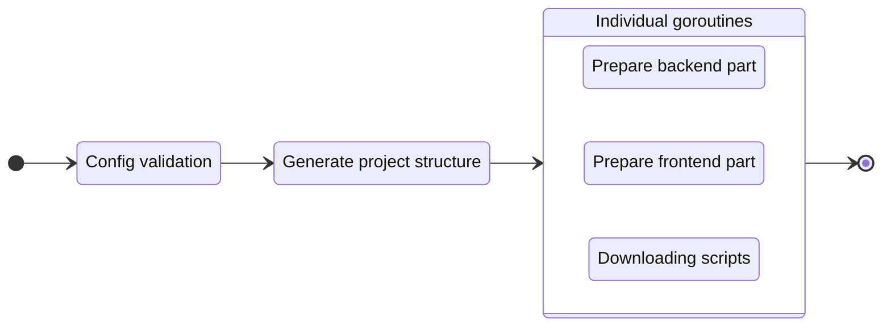

# Create a new project

!!! info "Using a default config"
    If you don't run `init` command to create a config file (`.gowebly.yml`), the **Gowebly** CLI creates a new project with a [default][repo_default_config] configuration.

To start a new project, execute the `create` command:

=== ":material-console-line: CLI"

    ``` bash
    gowebly create
    ```

=== "Go"

    ``` bash
    go run github.com/gowebly/gowebly@latest create
    ```

=== "Docker"

    ``` bash
    docker run --rm -it -v ${PWD}:${PWD} -w ${PWD} gowebly/gowebly:latest create
    ```


### What CLI does for you?

Every time you execute the `create` command for a project, the **Gowebly** CLI does the following under the hood:

| Step  | Description                                                                                                                               |           Is async?           |
| ----- | ----------------------------------------------------------------------------------------------------------------------------------------- | :---------------------------: |
| **1** | **CLI validates the config and applies it to the current project**                                                                        | :material-close:{.icon-close} |
| **2** | **CLI generates the structure of your project (folders and files)**                                                                       | :material-close:{.icon-close} |
| **3** | **CLI prepares the backend part of your project**                                                                                         |                               |
| 3.1   | CLI generates the needed utility files (`go.mod`, backend files, and so on)                                                               | :material-check:{.icon-check} |
| 3.2   | If `template_engine` is set to `templ`, CLI installs [Templ][templ_url] to your system and runs `templ generate`                          | :material-check:{.icon-check} |
| 3.3   | CLI runs `go mod tidy`                                                                                                                    | :material-check:{.icon-check} |
| **4** | **CLI prepares the frontend part of your project**                                                                                        |                               |
| 4.1   | CLI generates the `styles.css` file with minimal styles for the chosen CSS framework                                                      | :material-check:{.icon-check} |
| 4.2   | CLI generates the needed utility files (`package.json`, config for the chosen CSS framework, and so on)                                   | :material-check:{.icon-check} |
| 4.3   | CLI runs `install` and `build:dev` scripts from the `package.json` file with the chosen JavaScript runtime environment for the first time | :material-check:{.icon-check} |
| **5** | **CLI downloads minimized versions of htmx and hyperscript from the trusted [unpkg.com][unpkg_url] CDN**                                  | :material-check:{.icon-check} |

!!! tip "Asynchronous steps"
    The **Gowebly** CLI runs all blocks with asynchronous steps in individual **goroutines**. Therefore, creating a new project is several times faster than if you start each step one after another.

#### Diagram

For visualization of the **Gowebly** CLI workflow, check the diagram:



### Project structure after creating

Typically, after running the `create` command, a created project contains the following files and folders:

=== "Without template engines"

    ``` bash hl_lines="21 22"
    .
    ├── assets
    │   └── styles.css
    ├── static
    │   ├── favicons
    │   │   ├── apple-touch-icon.png
    │   │   ├── favicon.ico
    │   │   ├── favicon.png
    │   │   ├── favicon.svg
    │   │   ├── manifest-desktop-screenshot.jpeg
    │   │   ├── manifest-mobile-screenshot.jpeg
    │   │   └── manifest-touch-icon.svg
    │   ├── images
    │   │   └── logo.svg
    │   ├── htmx.min.js
    │   ├── hyperscript.min.js
    │   ├── styles.css
    │   └── manifest.json
    ├── templates
    │   ├── pages
    │   │   └── index.html
    │   └── main.html
    ├── .gitignore
    ├── go.mod
    ├── go.sum
    ├── handlers.go
    ├── main.go
    ├── package.json
    ├── package-lock.json
    └── server.go
    ```

=== "Using Templ"

    !!! danger "Auto-generated files"
        Please do **not** edit `*_templ.go` Go files in the `./templates` folder of your project! They're auto-generated by the **Templ** CLI from `*.templ` templates.

    ``` bash hl_lines="22 24"
    .
    ├── assets
    │   └── styles.css
    ├── static
    │   ├── favicons
    │   │   ├── apple-touch-icon.png
    │   │   ├── favicon.ico
    │   │   ├── favicon.png
    │   │   ├── favicon.svg
    │   │   ├── manifest-desktop-screenshot.jpeg
    │   │   ├── manifest-mobile-screenshot.jpeg
    │   │   └── manifest-touch-icon.svg
    │   ├── images
    │   │   └── logo.svg
    │   ├── htmx.min.js
    │   ├── hyperscript.min.js
    │   ├── styles.css
    │   └── manifest.json
    ├── templates
    │   ├── pages
    │   │   ├── index_templ.go
    │   │   └── index.templ
    │   ├── main_templ.go
    │   └── main.templ
    ├── .gitignore
    ├── go.mod
    ├── go.sum
    ├── handlers.go
    ├── main.go
    ├── package.json
    ├── package-lock.json
    └── server.go
    ```

<!-- Links -->

[repo_default_config]: https://github.com/gowebly/gowebly/blob/main/internal/attachments/configs/default.yml
[templ_url]: https://github.com/a-h/templ
[unpkg_url]: https://unpkg.com