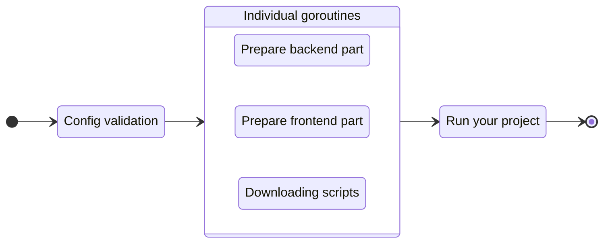

# Run your project

To run your project in a development mode, execute the `run` command:

::: code-group
```bash [CLI]
gowebly run
```

```bash [Go]
go run github.com/gowebly/gowebly@latest run
```

```bash [Docker]
docker run --rm -it -v ${PWD}:${PWD} -w ${PWD} gowebly/gowebly:latest run
```
:::

<!--@include: ../parts/block_default_config.md -->


## What CLI does for you?

Every time you execute the `run` command for a project, the **Gowebly** CLI does the following under the hood:

| Step  | Description                                                                                                    | Is async? |
| ----- | -------------------------------------------------------------------------------------------------------------- | :-------: |
| **1** | **CLI validates the config and applies it to the current project**                                             |    No     |
| **2** | **CLI prepares the backend part of your project**                                                              |           |
| 2.1   | If `template_engine` is set to `templ`, CLI runs `templ generate` with a `--watch` option                      |    Yes    |
| **3** | **CLI prepares the frontend part of your project**                                                             |           |
| 3.1   | CLI runs a `watch` script from the `package.json` file with the chosen JavaScript runtime environment          |    Yes    |
| **4** | **CLI downloads minimized versions of htmx and hyperscript from the trusted [unpkg.com][other_unpkg_url] CDN** |    Yes    |
| **5** | **CLI runs your project in a simple `go run` command and show HTTP logs in the terminal**                      |    No     |

::: tip Asynchronous steps
The **Gowebly** CLI runs all blocks with asynchronous steps in individual **goroutines**. Therefore, preparing to run your project is several times faster than if you start each step one after another.
:::

## Diagram

For visualization of the **Gowebly** CLI workflow, check the diagram:



<!--@include: ../parts/links.md -->