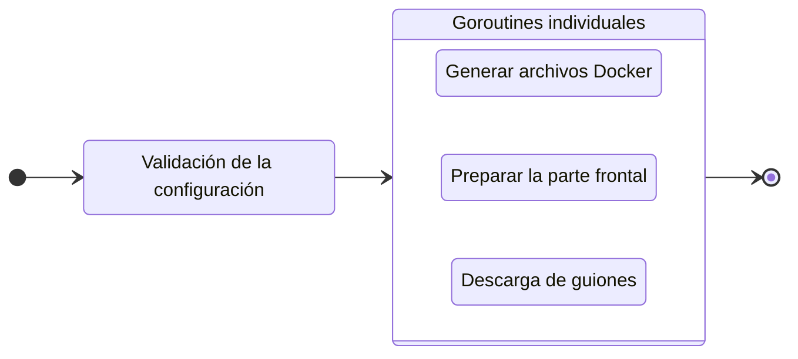

---
next:
  text: 'FAQ'
  link: '/es/faq'
---

# Construya su proyecto

Para preparar su proyecto para la producción, ejecute el comando `build`:

::: code-group
```bash [CLI]
gowebly build [OPTION]
```

```bash [Go]
go run github.com/gowebly/gowebly@latest build [OPTION]
```

```bash [Docker]
docker run --rm -it -v ${PWD}:${PWD} -w ${PWD} gowebly/gowebly:latest build [OPTION]
```
:::

Posibles opciones:

| Opción          | Descripción                                               | ¿Es obligatorio? |
| --------------- | --------------------------------------------------------- | :--------------: |
| `--skip-docker` | CLI omite un proceso de generación de los archivos Docker |        No        |

<!--@include: ../../parts/es/block_default_config.md -->


## ¿Qué hace la CLI por ti?

Cada vez que ejecutas el comando `build` para un proyecto, la CLI de **Gowebly** hace lo siguiente:

| Paso  | Descripción                                                                                                                          | ¿Es asíncrono? |
| ----- | ------------------------------------------------------------------------------------------------------------------------------------ | :------------: |
| **1** | **La CLI valida la configuración y la aplica al proyecto actual**                                                                    |       No       |
| **2** | **La CLI prepara los archivos Docker para tu proyecto**                                                                              |                |
| 2.1   | Si la opción `--skip-docker` no está establecida, la CLI genera los archivos Docker necesarios (`docker-compose.yml` y `Dockerfile`) |       Sí       |
| **3** | **La CLI prepara la parte frontend de tu proyecto**                                                                                  |                |
| 3.1   | La CLI ejecuta el script `build:prod` del archivo `package.json` con el entorno de ejecución de JavaScript elegido                   |       Sí       |
| **4** | **La CLI descarga las versiones minimizadas de htmx e hyperscript desde el confiable [unpkg.com][other_unpkg_url] CDN**              |       Sí       |

::: tip Pasos asíncronos
La CLI de **Gowebly** ejecuta todos los bloques con pasos asíncronos en **goroutines** individuales. Por lo tanto, la construcción de su proyecto es varias veces más rápido que si se inicia cada paso uno tras otro.
:::

## Diagrama

Para visualizar el flujo de trabajo de **Gowebly** CLI, consulte el diagrama:



## Estructura del proyecto tras la compilación

Normalmente, después de ejecutar el comando `build`, la estructura del proyecto tiene este aspecto:

```bash{9-10}
.
├── assets
│   └── ...
├── static
│   └── ...
├── templates
│   └── ...
├── .gitignore
├── docker-compose.yml
├── Dockerfile
├── go.mod
├── go.sum
├── handlers.go
├── main.go
├── package.json
├── package-lock.json
└── server.go
```

## Docker Compose

La CLI de **Gowebly** genera el archivo `docker-compose.yml` con la siguiente configuración:

```yaml
version: '3.8'

services:
  gowebly_default:
    build:
      context: .
      dockerfile: Dockerfile
    restart: unless-stopped
    ports:
      - '7000:7000'
    environment:
      BACKEND_PORT: 7000
      BACKEND_READ_TIMEOUT: 5
      BACKEND_WRITE_TIMEOUT: 10
    networks:
      - gowebly_default_network

networks:
  gowebly_default_network:
```

- El sufijo `_default` será actualizado por el nombre del framework Go elegido.
- El puerto del backend debe ser el mismo que el puerto expuesto del contenedor (por defecto, `7000`).
- La parte central `_default_` se actualizará con el nombre del framework Go elegido.

## Dockerfile

El CLI de **Gowebly** genera el archivo `Dockerfile` para usted con la siguiente configuración:

::: code-group
```dockerfile{17} [Sin motores de plantillas]
FROM golang:1.21-alpine AS builder

WORKDIR /build

COPY go.mod go.sum ./
RUN go mod download

COPY . .

ENV CGO_ENABLED=0
RUN go build -ldflags="-s -w" -o gowebly_default ./...

FROM scratch

COPY --from=builder /build/static /static
COPY --from=builder /build/gowebly_default /
COPY --from=builder /build/templates /templates

ENTRYPOINT ["/gowebly_default"]
```

```dockerfile [Utilizar Templ]
FROM golang:1.21-alpine AS builder

WORKDIR /build

COPY go.mod go.sum ./
RUN go mod download

COPY . .

ENV CGO_ENABLED=0
RUN go build -ldflags="-s -w" -o gowebly_default ./...

FROM scratch

COPY --from=builder /build/static /static
COPY --from=builder /build/gowebly_default /

ENTRYPOINT ["/gowebly_default"]
```
:::

::: tip Utilizar Templ
Cuando usas el motor de plantillas **Templ**, ya no necesitas incluir la carpeta `./templates` en tu contenedor. Todas las plantillas son funciones Go normales y se incluirán automáticamente en la compilación de tu aplicación.
:::

<!--@include: ../../parts/links.md -->