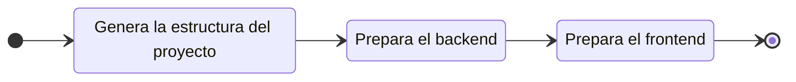

# Crear un nuevo proyecto

Para iniciar un nuevo proyecto, ejecuta el comando `create`:

::: code-group

```bash [CLI]
gowebly create
```

```bash [Go]
go run github.com/gowebly/gowebly/v3@latest create
```

:::

Y el resultado será algo como:


Generalmente, el proyecto creado contiene los siguientes archivos y carpetas:

- Los templates se encuentran en la carpeta `./templates`.
- El archivo CSS principal `styles.scss` se encuentra en la carpeta `./assets`.
- El archivo JavaScript principal `scripts.js` se encuentra en la carpeta `./assets`.
- El archivo para la PWD `manifest.json` y las imágenes se encuentran en la carpeta `./static`.

::: warning Go structure disclaimer
Por favor ten en cuenta que **Gowebly** no impone ninguna restricción sobre la arquitectura, estilo o estructura de tu proyecto. La CLI solo te ayuda a **iniciar rápidamente un nuevo proyecto** y genera todos los archivos necesarios para ti.

Por lo tanto, eres **libre de crear** la estructura de tu proyecto como desees.
:::

::: code-group

```bash{18,19} [Usando html/template]
.
├── assets
│   ├── scripts.js
│   └── styles.scss
├── static
│   ├── images
│   │   └── gowebly.svg
│   ├── apple-touch-icon.png
│   ├── favicon.ico
│   ├── favicon.png
│   ├── favicon.svg
│   ├── manifest-desktop-screenshot.jpeg
│   ├── manifest-mobile-screenshot.jpeg
│   ├── manifest-touch-icon.svg
│   └── manifest.json
├── templates
│   ├── pages
│   │   └── index.html
│   └── main.html
├── .air.toml
├── .dockerignore
├── .gitignore
├── .prettierignore
├── docker-compose.yml
├── Dockerfile
├── go.mod
├── go.sum
├── handlers.go
├── main.go
├── package.json
├── prettier.config.js
└── server.go
```

```bash{19,21} [Usando Templ]
.
├── assets
│   ├── scripts.js
│   └── styles.scss
├── static
│   ├── images
│   │   └── gowebly.svg
│   ├── apple-touch-icon.png
│   ├── favicon.ico
│   ├── favicon.png
│   ├── favicon.svg
│   ├── manifest-desktop-screenshot.jpeg
│   ├── manifest-mobile-screenshot.jpeg
│   ├── manifest-touch-icon.svg
│   └── manifest.json
├── templates
│   ├── pages
│   │   ├── index_templ.go
│   │   └── index.templ
│   ├── main_templ.go
│   └── main.templ
├── .air.toml
├── .dockerignore
├── .gitignore
├── .prettierignore
├── docker-compose.yml
├── Dockerfile
├── go.mod
├── go.sum
├── handlers.go
├── main.go
├── package.json
├── prettier.config.js
└── server.go
```

:::

::: danger Archivos generados por Templ
Por favor **no** edites los archivos Go `*_templ.go` en la carpeta `./templates` de tu proyecto! Son generados automáticamente por la CLI de **Templ** a partir de las plantillas `*.templ`.
:::

## ¿Qué hace la CLI por ti?

Cada vez que ejecutas el comando `create` para un crear un nuevo proyecto, la CLI de **Gowebly** hace lo siguiente:

| Paso  | Descripción                                                                                                      |
| :---: | ---------------------------------------------------------------------------------------------------------------- |
| **1** | **La estructura de tu proyecto**                                                                                 |
|       | CLI crea las carpetas del proyecto y todos los archivos necesarios                                               |
| **2** | **La parte del backend de tu proyecto**                                                                          |
|       | CLI genera los archivos backend (`go.mod`, archivos de los framework elegidos, etc.)                             |
|       | CLI corre `go mod tidy` y `go fmt` por primera vez                                                               |
| **3** | **La parte del frontend de tu proyecto**                                                                         |
|       | CLI genera el archivo `scripts.js` con la librería escogida                                                      |
|       | CLI genera el archivo `styles.scss` con estilos mínimos del framework CSS escogido                               |
|       | CLI genera los archivos necesarios (`package.json`, configuraciones para el framework CSS, entre otros)          |
|       | CLI ejecuta los scripts `install` y `build` desde el archivo `package.json` con el entorno frontend seleccionado |

Para visualizar el flujo de trabajo, consulta el diagrama:



<!--@include: ../../parts/links.md -->
