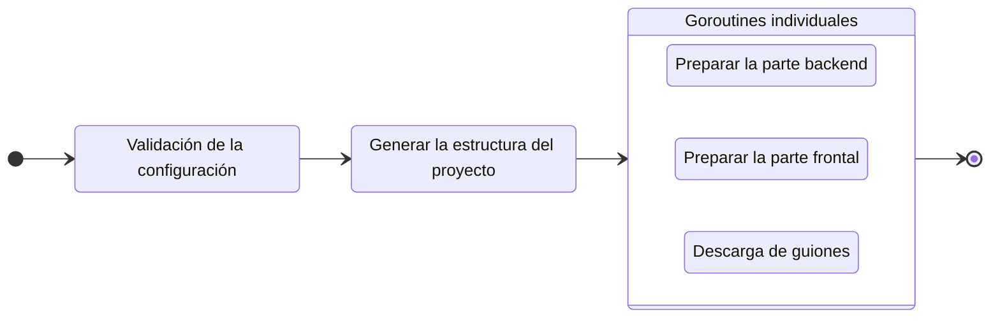

# Crear un nuevo proyecto

Para iniciar un nuevo proyecto, ejecute el comando `create`:

::: code-group
```bash [CLI]
gowebly create
```

```bash [Go]
go run github.com/gowebly/gowebly@latest create
```

```bash [Docker]
docker run --rm -it -v ${PWD}:${PWD} -w ${PWD} gowebly/gowebly:latest create
```
:::

<!--@include: ../../parts/es/block_default_config.md -->


## ¿Qué hace el CLI por ti?

Cada vez que ejecutas el comando `create` para un proyecto, el CLI de **Gowebly** realiza lo siguiente en segundo plano:

| Paso  | Descripción                                                                                                                                     | ¿Es asíncrono? |
| ----- | ----------------------------------------------------------------------------------------------------------------------------------------------- | :------------: |
| **1** | **El CLI valida la configuración y la aplica al proyecto actual**                                                                               |       No       |
| **2** | **El CLI genera la estructura de tu proyecto (carpetas y archivos)**                                                                            |       No       |
| **3** | **El CLI prepara la parte backend de tu proyecto**                                                                                              |                |
| 3.1   | El CLI genera los archivos de utilidad necesarios (`go.mod`, archivos de backend, y más)                                                        |       Sí       |
| 3.2   | Si `template_engine` está configurado como `templ`, el CLI instala [Templ][backend_ah_templ_url] en tu sistema y ejecuta `templ generate`       |       Sí       |
| 3.3   | El CLI ejecuta `go mod tidy`                                                                                                                    |       Sí       |
| **4** | **El CLI prepara la parte frontend de tu proyecto**                                                                                             |                |
| 4.1   | El CLI genera el archivo `styles.css` con estilos mínimos para el framework CSS elegido                                                         |       Sí       |
| 4.2   | El CLI genera los archivos de utilidad necesarios (`package.json`, configuración para el framework CSS elegido, y más)                          |       Sí       |
| 4.3   | El CLI ejecuta los scripts `install` y `build:dev` del archivo `package.json` con el entorno de ejecución de JavaScript elegido por primera vez |       Sí       |
| **5** | **El CLI descarga las versiones minimizadas de htmx e hyperscript desde el confiable [unpkg.com][other_unpkg_url] CDN**                         |       Sí       |

::: tip Pasos asíncronos
La CLI de **Gowebly** ejecuta todos los bloques con pasos asíncronos en **goroutines** individuales. Por lo tanto, la creación de un nuevo proyecto es varias veces más rápido que si se inicia cada paso uno tras otro.
:::

## Diagrama

Para visualizar el flujo de trabajo de **Gowebly** CLI, consulte el diagrama:



## Estructura del proyecto después de crearlo

Normalmente, tras ejecutar el comando `create`, un proyecto creado contiene los siguientes archivos y carpetas:

::: code-group
```bash{21,22} [Sin motores de plantillas]
.
├── assets
│   └── styles.css
├── static
│   ├── favicons
│   │   ├── apple-touch-icon.png
│   │   ├── favicon.ico
│   │   ├── favicon.png
│   │   ├── favicon.svg
│   │   ├── manifest-desktop-screenshot.jpeg
│   │   ├── manifest-mobile-screenshot.jpeg
│   │   └── manifest-touch-icon.svg
│   ├── images
│   │   └── logo.svg
│   ├── htmx.min.js
│   ├── hyperscript.min.js
│   ├── styles.css
│   └── manifest.json
├── templates
│   ├── pages
│   │   └── index.html
│   └── main.html
├── .gitignore
├── go.mod
├── go.sum
├── handlers.go
├── main.go
├── package.json
├── package-lock.json
└── server.go
```

```bash{22,24} [Utilizar Templ]
.
├── assets
│   └── styles.css
├── static
│   ├── favicons
│   │   ├── apple-touch-icon.png
│   │   ├── favicon.ico
│   │   ├── favicon.png
│   │   ├── favicon.svg
│   │   ├── manifest-desktop-screenshot.jpeg
│   │   ├── manifest-mobile-screenshot.jpeg
│   │   └── manifest-touch-icon.svg
│   ├── images
│   │   └── logo.svg
│   ├── htmx.min.js
│   ├── hyperscript.min.js
│   ├── styles.css
│   └── manifest.json
├── templates
│   ├── pages
│   │   ├── index_templ.go
│   │   └── index.templ
│   ├── main_templ.go
│   └── main.templ
├── .gitignore
├── go.mod
├── go.sum
├── handlers.go
├── main.go
├── package.json
├── package-lock.json
└── server.go
```
:::

::: danger Archivos autogenerates por Templ
Por favor, **no** edite los archivos `*_templ.go` Go en la carpeta `./templates` de su proyecto. Son autogenerates por la CLI de **Templ** a partir de las plantillas `*.templ`.
:::

<!--@include: ../../parts/links.md -->