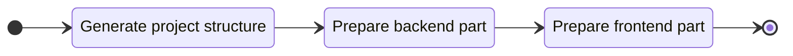

# Create a new project

To start a new project, execute the `create` command:

::: code-group
```bash [CLI]
gowebly create
```

```bash [Go]
go run github.com/gowebly/gowebly@latest create
```
:::

And result will be:


Typically, the created project contains the following files and folders:

- The templates are located in the `./templates` folder.
- The main CSS file `styles.scss` is located in the `./assets` folder.
- The main JavaScript file `scripts.js` is located in the `./assets` folder.
- The PWA manifest file `manifest.json` and images are located in the `./static` folder.

::: warning Go structure disclaimer
Please note, that the **Gowebly** does not impose any restrictions on the architecture, style or structure of your project. The CLI only helps you **quickly start a new project** and generates all the necessary files for you.

Therefore, you are **free to create** any project structure you wish.
:::

::: code-group
```bash{18,19} [Using html/template]
.
├── assets
│   ├── scripts.js
│   └── styles.scss
├── static
│   ├── images
│   │   └── gowebly.svg
│   ├── apple-touch-icon.png
│   ├── favicon.ico
│   ├── favicon.png
│   ├── favicon.svg
│   ├── manifest-desktop-screenshot.jpeg
│   ├── manifest-mobile-screenshot.jpeg
│   ├── manifest-touch-icon.svg
│   └── manifest.json
├── templates
│   ├── pages
│   │   └── index.html
│   └── main.html
├── .air.toml
├── .dockerignore
├── .gitignore
├── .prettierignore
├── docker-compose.yml
├── Dockerfile
├── go.mod
├── go.sum
├── handlers.go
├── main.go
├── package.json
├── prettier.config.js
└── server.go
```

```bash{19,21} [Using Templ]
.
├── assets
│   ├── scripts.js
│   └── styles.scss
├── static
│   ├── images
│   │   └── gowebly.svg
│   ├── apple-touch-icon.png
│   ├── favicon.ico
│   ├── favicon.png
│   ├── favicon.svg
│   ├── manifest-desktop-screenshot.jpeg
│   ├── manifest-mobile-screenshot.jpeg
│   ├── manifest-touch-icon.svg
│   └── manifest.json
├── templates
│   ├── pages
│   │   ├── index_templ.go
│   │   └── index.templ
│   ├── main_templ.go
│   └── main.templ
├── .air.toml
├── .dockerignore
├── .gitignore
├── .prettierignore
├── docker-compose.yml
├── Dockerfile
├── go.mod
├── go.sum
├── handlers.go
├── main.go
├── package.json
├── prettier.config.js
└── server.go
```
:::

::: danger Auto-generated files by Templ
Please do **not** edit `*_templ.go` Go files in the `./templates` folder of your project! They're auto-generated by the **Templ** CLI from `*.templ` templates.
:::

## What CLI does for you?

Every time you execute the `create` command for a project, the **Gowebly** CLI does the following under the hood:

| Step  | Description                                                                                                      |
| :---: | ---------------------------------------------------------------------------------------------------------------- |
| **1** | **The structure of your project**                                                                                |
|       | CLI creates the project folders and all needed miscellaneous files                                               |
| **2** | **The backend part of your project**                                                                             |
|       | CLI generates the backend files (`go.mod`, chosen Go framework files, and so on)                                 |
|       | CLI runs `go mod tidy` and `go fmt` for the first time                                                           |
| **3** | **The frontend part of your project**                                                                            |
|       | CLI generates the `scripts.js` file with importing the chosen reactivity library                                 |
|       | CLI generates the `styles.scss` file with minimal styles for the chosen CSS framework                            |
|       | CLI generates the needed utility files (`package.json`, config for the chosen CSS framework, and so on)          |
|       | CLI runs `install` and `build` scripts from the `package.json` file with the chosen frontend runtime environment |

To visualize the workflow, please refer to the diagram:



<!--@include: ../../parts/links.md -->