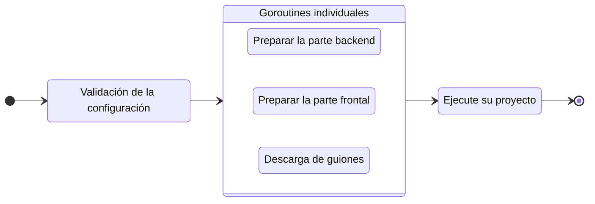

# Ejecute su proyecto

Para ejecutar su proyecto en modo de desarrollo, ejecute el comando `run`:

::: code-group
```bash [CLI]
gowebly run
```

```bash [Go]
go run github.com/gowebly/gowebly@latest run
```

```bash [Docker]
docker run --rm -it -v ${PWD}:${PWD} -w ${PWD} gowebly/gowebly:latest run
```
:::

<!--@include: ../../parts/es/block_default_config.md -->


## ¿Qué hace la CLI por ti?

Cada vez que ejecutas el comando `run` para un proyecto, la CLI de **Gowebly** realiza lo siguiente en segundo plano:

| Paso  | Descripción                                                                                                             | ¿Es asíncrono? |
| ----- | ----------------------------------------------------------------------------------------------------------------------- | :------------: |
| **1** | **La CLI valida la configuración y la aplica al proyecto actual**                                                       |       No       |
| **2** | **La CLI prepara la parte del backend de tu proyecto**                                                                  |                |
| 2.1   | Si `template_engine` está configurado como `templ`, la CLI ejecuta `templ generate` con la opción `--watch`             |       Sí       |
| **3** | **La CLI prepara la parte del frontend de tu proyecto**                                                                 |                |
| 3.1   | La CLI ejecuta un script `watch` desde el archivo `package.json` con el entorno de ejecución de JavaScript elegido      |       Sí       |
| **4** | **La CLI descarga las versiones minimizadas de htmx e hyperscript desde el CDN confiable [unpkg.com][other_unpkg_url]** |       Sí       |
| **5** | **La CLI ejecuta tu proyecto con un simple comando `go run` y muestra los registros HTTP en la terminal**               |       No       |

::: tip Pasos asíncronos
La CLI de **Gowebly** ejecuta todos los bloques con pasos asíncronos en **goroutines** individuales. Por lo tanto, la preparación para ejecutar su proyecto es varias veces más rápida que si inicia cada paso uno tras otro.
:::

## Diagrama

Para visualizar el flujo de trabajo de **Gowebly** CLI, consulte el diagrama:



<!--@include: ../../parts/links.md -->