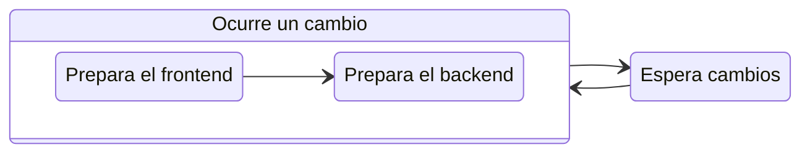

---
next:
  text: "FAQ"
  link: "/es/faq"
---

# Ejecutar tu proyecto

Para ejecutar tu proyecto en modo de desarrollo, ejecuta el comando `run`:

::: code-group

```bash [CLI]
gowebly run
```

```bash [Go]
go run github.com/gowebly/gowebly/v3@latest run
```

:::

## ¿Qué hace la CLI por ti?

Cada vez que ejecutas el comando `run` para un crear un nuevo proyecto, la CLI de **Gowebly** hace lo siguiente:

| Paso  | Descripción                                                                            |
| :---: | -------------------------------------------------------------------------------------- |
| **1** | **Inicia la herramienta Air**                                                          |
|       | CLI corre tu proyecto en modo live-reloading con un simple comando `air -c .air.toml`  |
| **2** | **Modo Live-reloading**                                                                |
|       | Air builds el frontend en modo producción                                              |
|       | Air genera las funciones de Go desde los templates `*.templ` templates, si se requiere |
|       | Air builds el backend de tu proyecto                                                   |
|       | Air queda a la espera de cambios en tu proyecto para hacer rebuilds                    |

Para visualizar el flujo de trabajo, consulta el diagrama:



<!--@include: ../../parts/links.md -->
