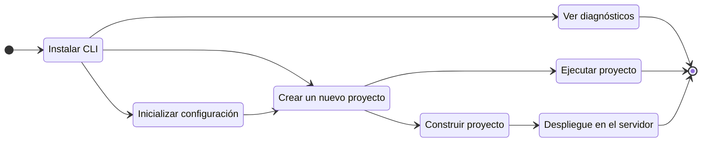

# ¿Qué es Gowebly CLI?

Esta sección te ayudará a entender qué es **Gowebly** CLI.

<!--@include: ../parts/es/block_want-to-try.md-->

El **Gowebly** CLI es un software libre y de código abierto que ayuda a construir fácilmente increíbles aplicaciones web con Go en el backend, utilizando htmx & hyperscript y los frameworks CSS atómicos/utility-first más populares en el frontend.

CLI genera un proyecto listo para usar que ayuda a entender la pila tecnológica **Go** + **htmx** + **hyperscript** + **CSS framework** lo más rápido posible y empezar a trabajar en ella con la máxima comodidad para el desarrollador. Muchos elementos del proyecto ya están configurados de forma óptima y listos para su uso.

Esto se muestra más claramente en el siguiente diagrama:

<!--@include: ../parts/links.md-->