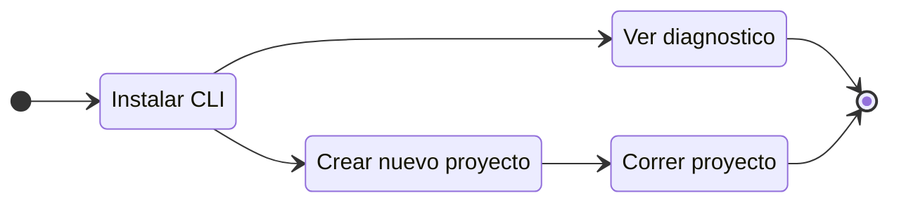

# ¿Qué es Gowebly CLI?

Esta sección te ayudará a entender qué es **Gowebly** CLI.

<!--@include: ../parts/es/block_want-to-try.md-->

La CLI de **Gowebly** es un software de código abierto y gratuito que ayuda a construir fácilmente aplicaciones web increíbles con Go en el backend, utilizando htmx & hyperscript y los más populares frameworks de CSS en el frontend.

Con esta CLI pudes generar un proyecto listo para usar que te ayuda a entender **Go** y **htmx** lo más rápido posible y comenzar a trabajar en ella con el máximo confort. Muchos elementos del proyecto están configurados de forma óptima, listos para producción.

Para visualizar el flujo de trabajo, consulte el diagrama:

<!--@include: ../../parts/links.md-->