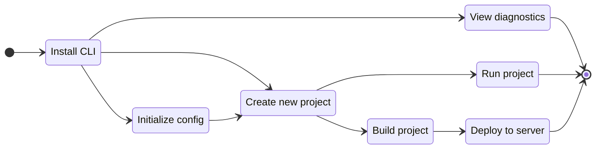

# What is Gowebly CLI?

This section will help you understand what **Gowebly** CLI is.

<!--@include: ./parts/block_want-to-try.md-->

The **Gowebly** CLI is a free and open source software that helps to easily build amazing web applications with Go on the backend, using htmx & hyperscript and the most popular atomic/utility-first CSS frameworks on the frontend.

CLI generates a ready-to-use project that helps to understand the **Go** + **htmx** + **hyperscript** + **CSS framework** technology stack as quickly as possible and start working on it with maximum developer comfort. Many project elements are already optimally configured and ready for use.

This is shown more clearly in the diagram below:

<!--@include: ./parts/links.md-->