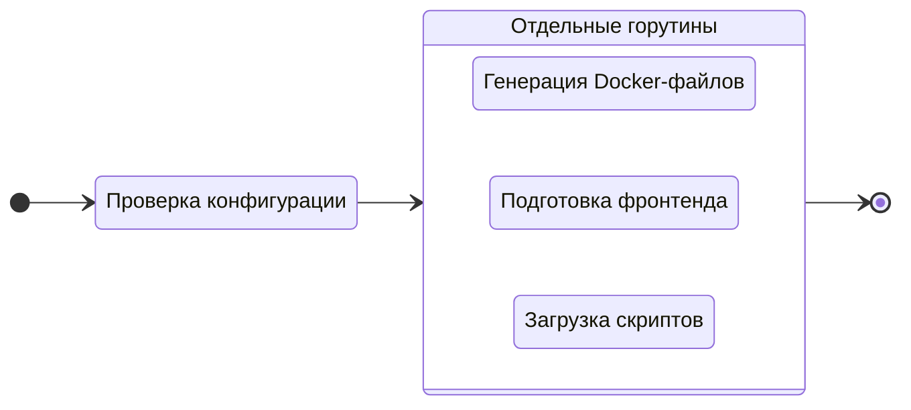

---
next:
  text: 'Вопросы и ответы'
  link: '/ru/faq'
---

# Сборка проекта

Для подготовки проекта к производству выполните команду `build`:

::: code-group
```bash [CLI]
gowebly build [OPTION]
```

```bash [Go]
go run github.com/gowebly/gowebly@latest build [OPTION]
```

```bash [Docker]
docker run --rm -it -v ${PWD}:${PWD} -w ${PWD} gowebly/gowebly:latest build [OPTION]
```
:::

Возможные опции:

| Опция           | Описание                                       | Обязательно? |
| --------------- | ---------------------------------------------- | :----------: |
| `--skip-docker` | CLI пропускает процесс генерации Docker-файлов |     Нет      |

<!--@include: ../../parts/ru/block_default_config.md -->


## Что CLI делает для вас?

Каждый раз, когда вы выполняете команду `build` для проекта, **Gowebly** CLI делает следующее под капотом:

| Шаг   | Описание                                                                                                                 | Асинхронно? |
| ----- | ------------------------------------------------------------------------------------------------------------------------ | :---------: |
| **1** | **CLI проверяет конфигурацию и применяет её к текущему проекту**                                                         |     Нет     |
| **2** | **CLI подготавливает Docker-файлы для вашего проекта**                                                                   |             |
| 2.1   | Если опция `--skip-docker` не установлена, CLI генерирует необходимые Docker-файлы (`docker-compose.yml` и `Dockerfile`) |     Да      |
| **3** | **CLI подготавливает фронтенд-часть вашего проекта**                                                                     |             |
| 3.1   | CLI запускает сценарий `build:prod` из файла `package.json` с выбранной средой выполнения JavaScript                     |     Да      |
| **4** | **CLI загружает минимизированные версии htmx и hyperscript из доверенного CDN [unpkg.com][other_unpkg_url]**             |     Да      |

::: tip Асинхронные шаги
CLI **Gowebly** запускает все блоки с асинхронными шагами в отдельных **горутинах**. Таким образом, сборка проекта происходит в несколько раз быстрее, чем если бы вы запускали каждый шаг последовательно.
:::

## Диаграмма

Для визуализации рабочего процесса **Gowebly** CLI приведена диаграмма:



## Структура проекта после сборки

Как правило, после выполнения команды `build` структура проекта выглядит следующим образом:

```bash{9-10}
.
├── assets
│   └── ...
├── static
│   └── ...
├── templates
│   └── ...
├── .gitignore
├── docker-compose.yml
├── Dockerfile
├── go.mod
├── go.sum
├── handlers.go
├── main.go
├── package.json
├── package-lock.json
└── server.go
```

## Docker Compose

CLI **Gowebly** генерирует для вас файл `docker-compose.yml` со следующими настройками:

```yaml
version: '3.8'

services:
  gowebly_default:
    build:
      context: .
      dockerfile: Dockerfile
    restart: unless-stopped
    ports:
      - '7000:7000'
    environment:
      BACKEND_PORT: 7000
      BACKEND_READ_TIMEOUT: 5
      BACKEND_WRITE_TIMEOUT: 10
    networks:
      - gowebly_default_network

networks:
  gowebly_default_network:
```

- Суффикс `_default` будет обновлён именем выбранного Go-фреймворка.
- Порт бэкенда должен совпадать с портом контейнера (по умолчанию `7000`).
- Средняя часть `_default_` будет обновлена именем выбранного Go-фреймворка.

## Dockerfile

CLI **Gowebly** генерирует для вас файл `Dockerfile` со следующими настройками:

::: code-group
```dockerfile{17} [Без шаблонизаторов]
FROM golang:1.21-alpine AS builder

WORKDIR /build

COPY go.mod go.sum ./
RUN go mod download

COPY . .

ENV CGO_ENABLED=0
RUN go build -ldflags="-s -w" -o gowebly_default ./...

FROM scratch

COPY --from=builder /build/static /static
COPY --from=builder /build/gowebly_default /
COPY --from=builder /build/templates /templates

ENTRYPOINT ["/gowebly_default"]
```

```dockerfile [С использованием Templ]
FROM golang:1.21-alpine AS builder

WORKDIR /build

COPY go.mod go.sum ./
RUN go mod download

COPY . .

ENV CGO_ENABLED=0
RUN go build -ldflags="-s -w" -o gowebly_default ./...

FROM scratch

COPY --from=builder /build/static /static
COPY --from=builder /build/gowebly_default /

ENTRYPOINT ["/gowebly_default"]
```
:::

::: tip Использование Templ
При использовании шаблонизатора **Templ** — больше нет необходимости включать в контейнер папку `./templates`. Все шаблоны являются обычными Go-функциями и будут автоматически включены в сборку вашего приложения.
:::

<!--@include: ../../parts/links.md -->