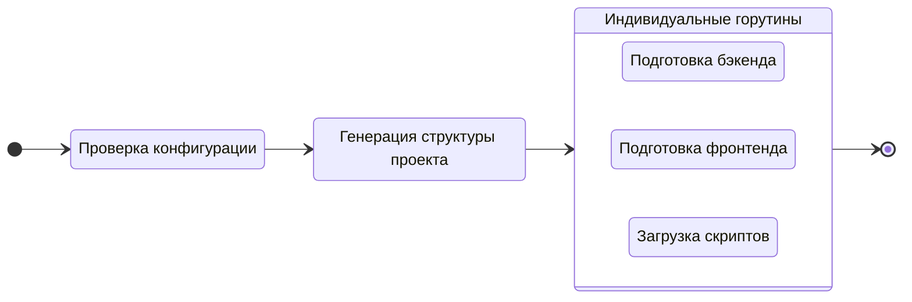

# Создание нового проекта

Чтобы создать новый проект, выполните команду `create`:

::: code-group
```bash [CLI]
gowebly create
```

```bash [Go]
go run github.com/gowebly/gowebly@latest create
```

```bash [Docker]
docker run --rm -it -v ${PWD}:${PWD} -w ${PWD} gowebly/gowebly:latest create
```
:::

<!--@include: ../../parts/ru/block_default_config.md -->


## Что CLI делает для вас?

Каждый раз, когда вы выполняете команду `create` для проекта, **Gowebly** CLI делает следующее под капотом:

| Шаг   | Описание                                                                                                                                          | Асинхронно? |
| ----- | ------------------------------------------------------------------------------------------------------------------------------------------------- | :---------: |
| **1** | **CLI проверяет и применяет конфигурацию к текущему проекту**                                                                                     |     Нет     |
| **2** | **CLI генерирует структуру вашего проекта (папки и файлы)**                                                                                       |     Нет     |
| **3** | **CLI подготавливает backend-часть вашего проекта**                                                                                               |             |
| 3.1   | CLI генерирует необходимые служебные файлы (`go.mod`, backend-файлы и т.д.)                                                                       |     Да      |
| 3.2   | Если `template_engine` установлен в значение `templ`, CLI устанавливает [Templ][backend_ah_templ_url] в вашу систему и запускает `templ generate` |     Да      |
| 3.3   | CLI выполняет `go mod tidy`                                                                                                                       |     Да      |
| **4** | **CLI подготавливает frontend-часть вашего проекта**                                                                                              |             |
| 4.1   | CLI генерирует файл `styles.css` с минимальными стилями для выбранного CSS-фреймворка                                                             |     Да      |
| 4.2   | CLI генерирует необходимые служебные файлы (`package.json`, конфигурацию для выбранного CSS-фреймворка и т.д.)                                    |     Да      |
| 4.3   | CLI выполняет скрипты `install` и `build:dev` из файла `package.json` с выбранной средой выполнения JavaScript в первый раз                       |     Да      |
| **5** | **CLI загружает минимизированные версии htmx и hyperscript из доверенного CDN [unpkg.com][other_unpkg_url]**                                      |     Да      |

::: tip Асинхронные шаги
В **Gowebly** CLI все блоки с асинхронными шагами выполняются в отдельных **горутинах**. Поэтому создание нового проекта происходит в несколько раз быстрее, чем если бы вы запускали каждый шаг последовательно.
:::

## Диаграмма

Для визуализации рабочего процесса **Gowebly** CLI приведена диаграмма:



## Структура проекта после создания

Как правило, после выполнения команды `create` созданный проект содержит следующие файлы и папки:

::: code-group
```bash{21,22} [Без шаблонизаторов]
.
├── assets
│   └── styles.css
├── static
│   ├── favicons
│   │   ├── apple-touch-icon.png
│   │   ├── favicon.ico
│   │   ├── favicon.png
│   │   ├── favicon.svg
│   │   ├── manifest-desktop-screenshot.jpeg
│   │   ├── manifest-mobile-screenshot.jpeg
│   │   └── manifest-touch-icon.svg
│   ├── images
│   │   └── logo.svg
│   ├── htmx.min.js
│   ├── hyperscript.min.js
│   ├── styles.css
│   └── manifest.json
├── templates
│   ├── pages
│   │   └── index.html
│   └── main.html
├── .gitignore
├── go.mod
├── go.sum
├── handlers.go
├── main.go
├── package.json
├── package-lock.json
└── server.go
```

```bash{22,24} [С использованием Templ]
.
├── assets
│   └── styles.css
├── static
│   ├── favicons
│   │   ├── apple-touch-icon.png
│   │   ├── favicon.ico
│   │   ├── favicon.png
│   │   ├── favicon.svg
│   │   ├── manifest-desktop-screenshot.jpeg
│   │   ├── manifest-mobile-screenshot.jpeg
│   │   └── manifest-touch-icon.svg
│   ├── images
│   │   └── logo.svg
│   ├── htmx.min.js
│   ├── hyperscript.min.js
│   ├── styles.css
│   └── manifest.json
├── templates
│   ├── pages
│   │   ├── index_templ.go
│   │   └── index.templ
│   ├── main_templ.go
│   └── main.templ
├── .gitignore
├── go.mod
├── go.sum
├── handlers.go
├── main.go
├── package.json
├── package-lock.json
└── server.go
```
:::

::: danger Автоматически-генерируемые файлы Templ
Пожалуйста, **не** редактируйте Go-файлы `*_templ.go` в папке `./templates` вашего проекта! Они автоматически генерируются с помощью **Templ** CLI из шаблонов `*.templ`.
:::

<!--@include: ../../parts/links.md -->