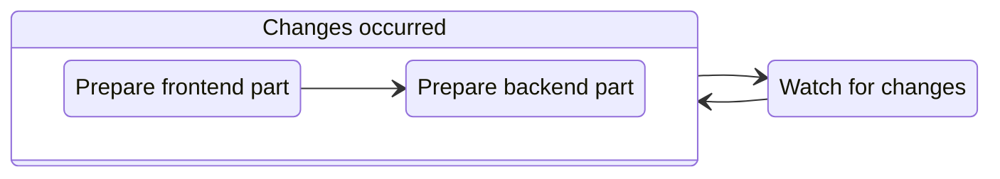

---
next:
  text: 'FAQ'
  link: '/ru/faq'
---

# Run your project

To run your project in a development mode, execute the `run` command:

::: code-group
```bash [CLI]
gowebly run
```

```bash [Go]
go run github.com/gowebly/gowebly@latest run
```
:::

## What CLI does for you?

Every time you execute the `run` command for a project, the **Gowebly** CLI does the following under the hood:

| Step  | Description                                                                           |
| :---: | ------------------------------------------------------------------------------------- |
| **1** | **Start Air tool**                                                                    |
|       | CLI runs your project with live-reloading mode in a simple `air -c .air.toml` command |
| **2** | **Live-reloading mode**                                                               |
|       | Air tool builds frontend part of your project in production mode                      |
|       | Air tool generates Go functions from `*.templ` templates, if needed                   |
|       | Air tool builds the backend part of your project                                      |
|       | Air tool watches for changes in your project files and rebuilds them                  |

To visualize the workflow, please refer to the diagram:



<!--@include: ../../parts/links.md -->