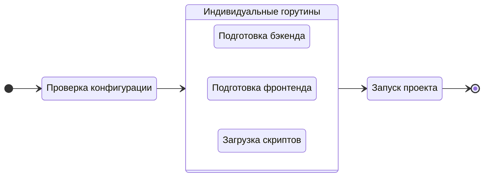

# Запуск проекта

Чтобы запустить проект в режиме разработки, выполните команду `run`:

::: code-group
```bash [CLI]
gowebly run
```

```bash [Go]
go run github.com/gowebly/gowebly@latest run
```

```bash [Docker]
docker run --rm -it -v ${PWD}:${PWD} -w ${PWD} gowebly/gowebly:latest run
```
:::

<!--@include: ../../parts/ru/block_default_config.md -->


## Что делает CLI для вас?

Каждый раз, когда вы запускаете команду `run` для проекта, **Gowebly** CLI выполняет следующие действия:

| Шаг   | Описание                                                                                                    | Асинхронно? |
| ----- | ----------------------------------------------------------------------------------------------------------- | :---------: |
| **1** | **CLI проверяет и применяет конфигурацию к текущему проекту**                                               |     Нет     |
| **2** | **CLI подготавливает backend-часть вашего проекта**                                                         |             |
| 2.1   | Если `template_engine` установлен в `templ`, CLI выполняет `templ generate` с опцией `--watch`              |     Да      |
| **3** | **CLI подготавливает frontend-часть вашего проекта**                                                        |             |
| 3.1   | CLI выполняет скрипт `watch` из файла `package.json` с выбранной средой выполнения JavaScript               |     Да      |
| **4** | **CLI скачивает минимизированные версии htmx и hyperscript с доверенного CDN [unpkg.com][other_unpkg_url]** |     Да      |
| **5** | **CLI запускает ваш проект с помощью простой команды `go run` и показывает HTTP-логи в терминале**          |     Нет     |

::: tip Асинхронные шаги
В **Gowebly** CLI все блоки с асинхронными шагами запускаются в отдельных **горутинах**. Таким образом, подготовка к запуску проекта происходит в несколько раз быстрее, чем если бы вы запускали каждый шаг по очереди.
:::

## Диаграмма

Для визуализации рабочего процесса **Gowebly** CLI приведена диаграмма:



<!--@include: ../../parts/links.md -->