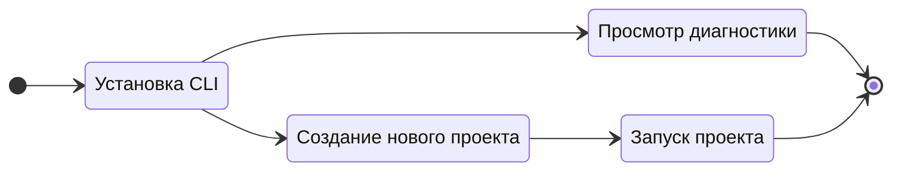

# Что такое Gowebly CLI?

Этот раздел поможет вам понять, что такое **Gowebly** CLI.

<!--@include: ../parts/ru/block_want-to-try.md-->

CLI **Gowebly** — это свободное программное обеспечение с открытым исходным кодом, позволяющее легко создавать удивительные веб-приложения с использованием Go на бэкенде, htmx, hyperscript и наиболее популярные atomic/utility-first CSS-фреймворки на фронтенде.

CLI генерирует готовый к использованию проект, позволяющий максимально быстро разобраться в технологическом стеке **Go** + **htmx** + **hyperscript** + **CSS-фреймворк** и начать работу над ним с максимальным комфортом для разработчика. Многие элементы проекта уже оптимально настроены и готовы к использованию.

Более наглядно это показано на диаграмме ниже:

<!--@include: ../parts/links.md-->