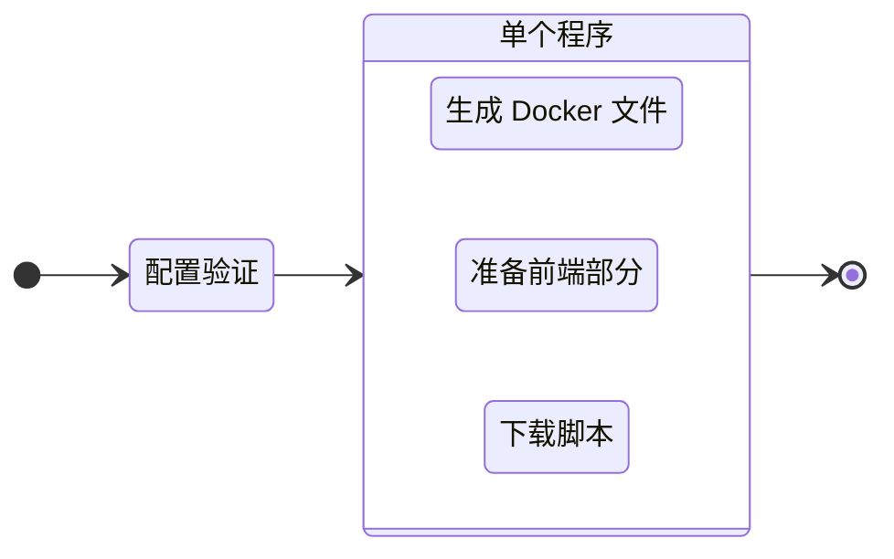

# 构建项目

要准备生产项目，请执行 `build` 命令：

::: code-group
```bash [CLI]
gowebly build [OPTION]
```

```bash [Go]
go run github.com/gowebly/gowebly@latest build [OPTION]
```

```bash [Docker]
docker run --rm -it -v ${PWD}:${PWD} -w ${PWD} gowebly/gowebly:latest build [OPTION]
```
:::

可能的选择：

| 选项            | 说明                           | 是否需要？ |
| --------------- | ------------------------------ | :--------: |
| `--skip-docker` | CLI 跳过生成 Docker 文件的过程 |    没有    |

<!--@include: ../../parts/block_default_config.md -->


## CLI 能为你做什么？

每次执行项目的 `build` 命令时，Gowebly CLI 都会执行以下工作：

| 步骤  | 说明                                                                                                    | 是异步吗？ |
| ----- | ------------------------------------------------------------------------------------------------------- | :--------: |
| **1** | CLI 验证配置并将其应用于当前项目                                                                        |    没有    |
| **2** | CLI 为项目准备 Docker 文件                                                                              |            |
| 2.1   | 如果未设置 `--skip-docker` 选项，CLI 会生成所需的 Docker 文件（`docker-compose.yml` 和 `Dockerfile`）。 |     是     |
| **3** | CLI 准备项目的前端部分                                                                                  |            |
| 3.1   | CLI 使用选定的 JavaScript 运行时环境，从 `package.json` 文件运行 `build:prod` 脚本                      |     是     |
| **4** | CLI 从可信的 [unpkg.com][other_unpkg_url] CDN 下载最小化版本的 htmx 和 hyperscript。                    |     是     |

::: tip 异步步骤
Gowebly CLI 在单个 goroutines 中运行所有具有异步步骤的模块。因此，构建项目的速度要比一个接一个地启动每个步骤快好几倍。
:::

## 图表

有关 Gowebly CLI 工作流程的可视化，请查看示意图：



## 构建后的项目结构

通常情况下，运行 `build` 命令后，项目结构如下：

```bash{9-10}
.
├── assets
│   └── ...
├── static
│   └── ...
├── templates
│   └── ...
├── .gitignore
├── docker-compose.yml
├── Dockerfile
├── go.mod
├── go.sum
├── handlers.go
├── main.go
├── package.json
├── package-lock.json
└── server.go
```

## Docker Compose

Gowebly CLI 会根据以下设置为您生成 `docker-compose.yml` 文件：

```yaml
version: '3.8'

services:
  gowebly_default:
    build:
      context: .
      dockerfile: Dockerfile
    restart: unless-stopped
    ports:
      - '7000:7000'
    environment:
      BACKEND_PORT: 7000
      BACKEND_READ_TIMEOUT: 5
      BACKEND_WRITE_TIMEOUT: 10
    networks:
      - gowebly_default_network

networks:
  gowebly_default_network:
```

- 后缀 `_default` 将根据所选 Go 框架的名称进行更新。
- 后端端口应与暴露的容器端口相同（默认为 `7000`）。
- 中间的 `_default_` 部分将根据所选 Go 框架的名称进行更新。

## Dockerfile

Gowebly CLI 会根据以下设置为你生成 `Dockerfile` 文件：

::: code-group
```dockerfile{17} [无模板引擎]
FROM golang:1.21-alpine AS builder

WORKDIR /build

COPY go.mod go.sum ./
RUN go mod download

COPY . .

ENV CGO_ENABLED=0
RUN go build -ldflags="-s -w" -o gowebly_default ./...

FROM scratch

COPY --from=builder /build/static /static
COPY --from=builder /build/gowebly_default /
COPY --from=builder /build/templates /templates

ENTRYPOINT ["/gowebly_default"]
```

```dockerfile [使用 Templ]
FROM golang:1.21-alpine AS builder

WORKDIR /build

COPY go.mod go.sum ./
RUN go mod download

COPY . .

ENV CGO_ENABLED=0
RUN go build -ldflags="-s -w" -o gowebly_default ./...

FROM scratch

COPY --from=builder /build/static /static
COPY --from=builder /build/gowebly_default /

ENTRYPOINT ["/gowebly_default"]
```
:::

::: tip 使用 Templ
使用 Templ 模板引擎时，您不再需要在容器中包含 `./templates` 文件夹。所有模板都是普通的 Go 函数，会自动包含在应用程序的构建中。
:::

<!--@include: ../../parts/links.md -->