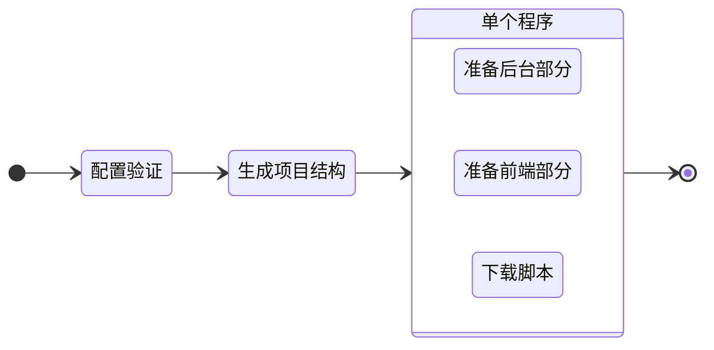

# 创建新项目

要启动一个新项目，请执行 `create` 命令：

::: code-group
```bash [CLI]
gowebly create
```

```bash [Go]
go run github.com/gowebly/gowebly@latest create
```

```bash [Docker]
docker run --rm -it -v ${PWD}:${PWD} -w ${PWD} gowebly/gowebly:latest create
```
:::

<!--@include: ../../parts/block_default_config.md -->


## CLI 能为你做什么？

每次执行项目的 `create` 命令时，Gowebly CLI 都会执行以下工作：

| 步骤  | 说明                                                                                                                  | 是异步吗？ |
| ----- | --------------------------------------------------------------------------------------------------------------------- | :--------: |
| **1** | CLI 验证配置并将其应用于当前项目                                                                                      |    没有    |
| **2** | CLI 生成项目结构（文件夹和文件）                                                                                      |    没有    |
| **3** | CLI 准备项目的后台部分                                                                                                |            |
| 3.1   | CLI 生成所需的实用程序文件（`go.mod`、后端文件等）。                                                                  |     是     |
| 3.2   | 如果将 `template_engine` 设置为 `templ`，CLI 会在系统中安装 [Templ][backend_ah_templ_url]，并运行 `templ generate` 。 |     是     |
| 3.3   | CLI 运行 `go mod tidy`                                                                                                |     是     |
| **4** | CLI 准备项目的前端部分                                                                                                |            |
| 4.1   | CLI 为所选 CSS 框架生成包含最小样式的 `styles.css` 文件                                                               |     是     |
| 4.2   | CLI 会生成所需的实用程序文件（`package.json`、所选 CSS 框架的配置等）。                                               |     是     |
| 4.3   | CLI 首次使用选定的 JavaScript 运行时环境运行 `package.json` 文件中的 `install` 和 `build:dev` 脚本                    |     是     |
| **5** | CLI 从可信的 [unpkg.com][other_unpkg_url] CDN 下载最小化版本的 htmx 和 hyperscript。                                  |     是     |

::: tip 异步步骤
Gowebly CLI 在单个 goroutines 中运行所有具有异步步骤的模块。因此，创建一个新项目要比逐个启动每个步骤快几倍。
:::

## 图表

有关 Gowebly CLI 工作流程的可视化，请查看示意图：



## 创建后的项目结构

通常情况下，运行 `create` 命令后，创建的项目包含以下文件和文件夹：

::: code-group
```bash{21,22} [无模板引擎]
.
├── assets
│   └── styles.css
├── static
│   ├── favicons
│   │   ├── apple-touch-icon.png
│   │   ├── favicon.ico
│   │   ├── favicon.png
│   │   ├── favicon.svg
│   │   ├── manifest-desktop-screenshot.jpeg
│   │   ├── manifest-mobile-screenshot.jpeg
│   │   └── manifest-touch-icon.svg
│   ├── images
│   │   └── logo.svg
│   ├── htmx.min.js
│   ├── hyperscript.min.js
│   ├── styles.css
│   └── manifest.json
├── templates
│   ├── pages
│   │   └── index.html
│   └── main.html
├── .gitignore
├── go.mod
├── go.sum
├── handlers.go
├── main.go
├── package.json
├── package-lock.json
└── server.go
```

```bash{22,24} [使用 Templ]
.
├── assets
│   └── styles.css
├── static
│   ├── favicons
│   │   ├── apple-touch-icon.png
│   │   ├── favicon.ico
│   │   ├── favicon.png
│   │   ├── favicon.svg
│   │   ├── manifest-desktop-screenshot.jpeg
│   │   ├── manifest-mobile-screenshot.jpeg
│   │   └── manifest-touch-icon.svg
│   ├── images
│   │   └── logo.svg
│   ├── htmx.min.js
│   ├── hyperscript.min.js
│   ├── styles.css
│   └── manifest.json
├── templates
│   ├── pages
│   │   ├── index_templ.go
│   │   └── index.templ
│   ├── main_templ.go
│   └── main.templ
├── .gitignore
├── go.mod
├── go.sum
├── handlers.go
├── main.go
├── package.json
├── package-lock.json
└── server.go
```
:::

::: danger 由 Templ 自动生成的文件
请不要编辑项目的 `./templates` 文件夹中的 `*_templ.go` Go 文件！它们是由 Templ CLI 从 `*.templ` 模板中自动生成的。
:::

<!--@include: ../../parts/links.md -->