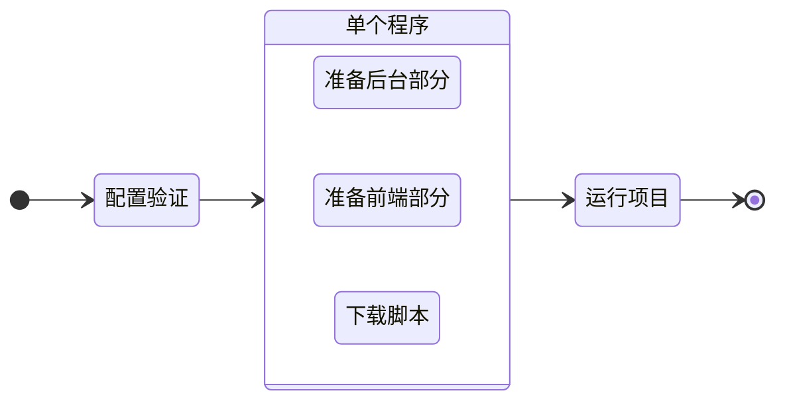

# 运行项目

要在开发模式下运行项目，请执行 `run` 命令：

::: code-group
```bash [CLI]
gowebly run
```

```bash [Go]
go run github.com/gowebly/gowebly@latest run
```

```bash [Docker]
docker run --rm -it -v ${PWD}:${PWD} -w ${PWD} gowebly/gowebly:latest run
```
:::

<!--@include: ../../parts/block_default_config.md -->


## CLI 能为你做什么？

每次执行项目的 `run` 命令时，Gowebly CLI 都会执行以下工作：

| 步骤  | 说明                                                                                       | 是异步吗？ |
| ----- | ------------------------------------------------------------------------------------------ | :--------: |
| **1** | CLI 验证配置并将其应用于当前项目                                                           |    没有    |
| **2** | CLI 准备项目的后台部分                                                                     |            |
| 2.1   | 如果将 `template_engine` 设为 `templ`，CLI 会运行带有 `--watch` 选项的 `templ generate` 。 |     是     |
| **3** | CLI 准备项目的前端部分                                                                     |            |
| 3.1   | CLI 使用选定的 JavaScript 运行时环境，从 `package.json` 文件中运行 `watch` 脚本            |     是     |
| **4** | CLI 从可信的 [unpkg.com][other_unpkg_url] CDN 下载最小化版本的 htmx 和 hyperscript。       |     是     |
| **5** | CLI 通过简单的 `go run` 命令运行项目，并在终端显示 HTTP 日志                               |    没有    |

::: tip 异步步骤
Gowebly CLI 在单个 goroutines 中运行所有带异步步骤的模块。因此，准备运行项目的速度要比一个接一个地启动每个步骤快好几倍。
:::

## 图表

有关 Gowebly CLI 工作流程的可视化，请查看示意图：



<!--@include: ../../parts/links.md -->