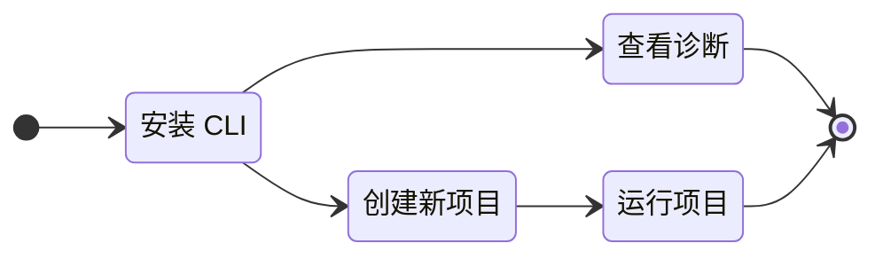

# 什么是 Gowebly CLI？

本节将帮助您了解什么是 Gowebly CLI。

<!--@include: ../parts/zh_HK/block_want-to-try.md-->

Gowebly CLI 是一款免费开源软件，可帮助您在后端使用 Go，在前端使用 htmx 和 hyperscript 以及最流行的原子/实用优先 CSS 框架，轻松构建令人惊叹的网络应用程序。

CLI 可生成一个即用型项目，帮助开发人员尽快了解 Go + htmx + hyperscript + CSS 框架技术栈，并以最舒适的方式开始工作。许多项目元素已经过优化配置，可以随时使用。

下图更清楚地说明了这一点：

<!--@include: ../parts/links.md-->